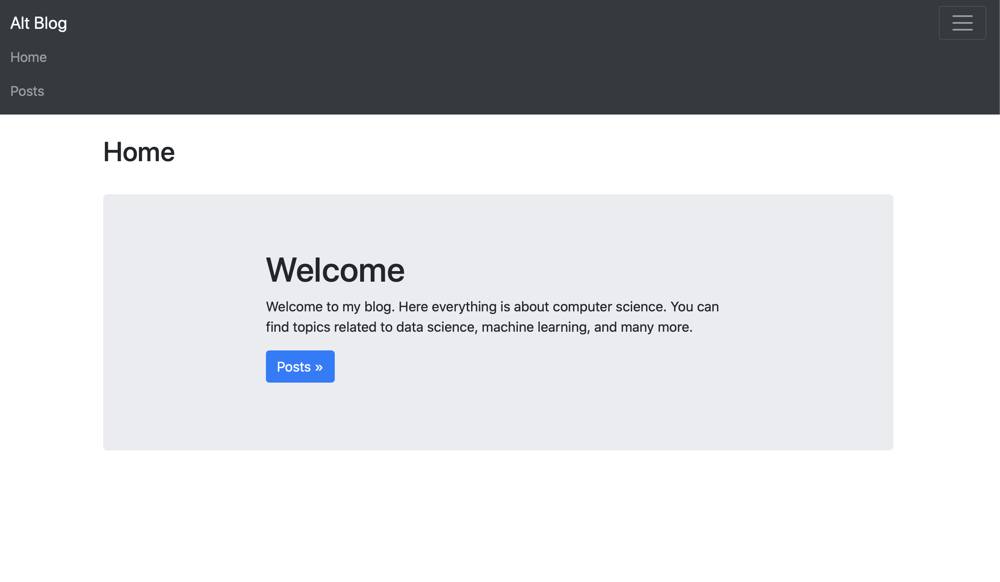
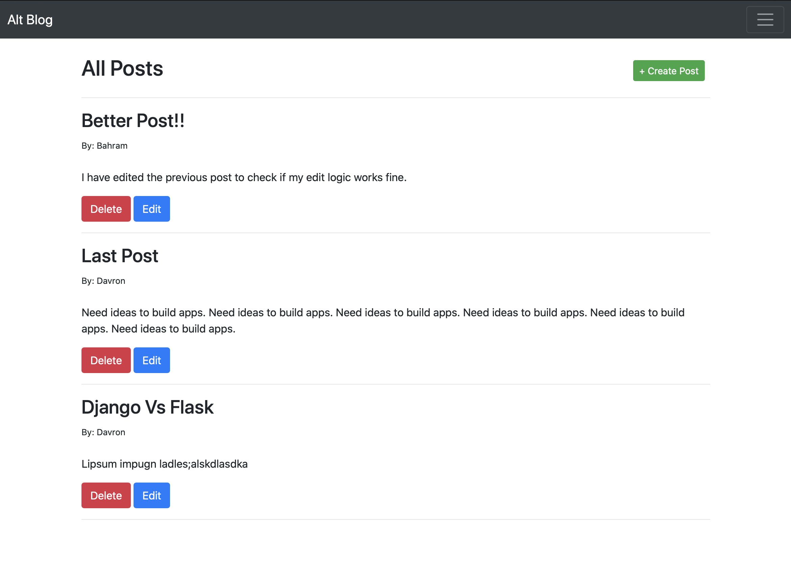

# Alt Blog

Alt Blog is a basic blog web application. User able to create, edit/update, delete, or read posts. 

## Tech Stack

* **SQLAlchemy ORM** to be ORM library of choice
* **SQLite** as database of choice
* **Python3** and **Flask** as server language and server framework
* [Bootstrap 4](https://getbootstrap.com/docs/3.4/customize/) for website's frontend

## Running Locally

Make sure you have Python 3.8.0 [downloads](https://www.python.org/downloads/).

To start and run the local development server,

1. Initialize and activate a virtualenv:
  ```
  $ cd YOUR_PROJECT_DIRECTORY_PATH/
  $ python3 -m venv env
  $ source env/bin/activate
  ```

2. Install the dependencies:
  ```
  $ pip install -r requirements.txt
  ```

3. Run the development server:
  ```
  $ export FLASK_APP=myapp
  $ export FLASK_ENV=development # enables debug mode
  $ python3 app.py
  ```

4. Navigate to Home page [http://localhost:5000](http://localhost:5000)

## Screenshots






## Sample input
