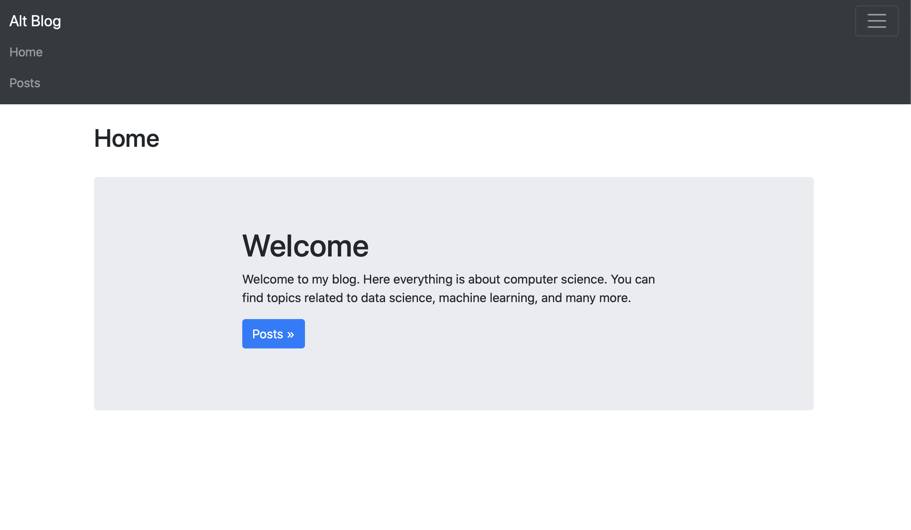
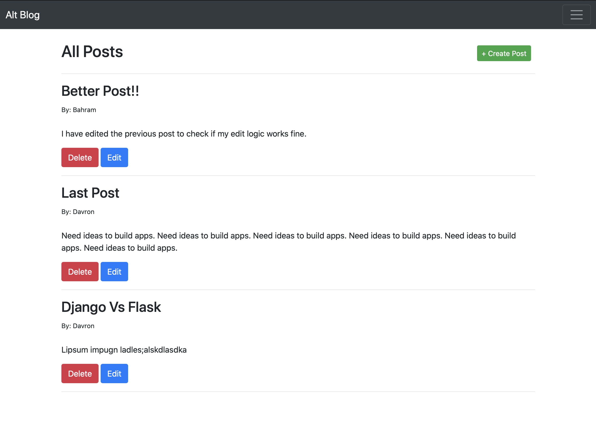

# Alt Blog

Alt Blog is a blog web application. User able to create, edit/update, delete, or read posts.

## Tech Stack

- **SQLAlchemy ORM** to be ORM library of choice
- **SQLite** as database of choice
- **Python3** and **Flask** as server language and server framework
- [Bootstrap 4](https://getbootstrap.com/docs/4.3/getting-started/introduction/) for website's frontend

## Running Locally

Make sure you have Python 3.7.7 [downloads](https://www.python.org/downloads/).

To start and run the local development server,

1. Initialize and activate a virtualenv:

```
$ cd YOUR_PROJECT_DIRECTORY_PATH/
$ virtualenv -p python3 venv
$ source venv/bin/activate
```

2. Install the dependencies:

```
$ pip install -r requirements.txt
```

3. Run the development server:

.flaskenv file provides development server

```
$ flask run
```

4. Navigate to Home page [http://localhost:5000](http://localhost:5000)

## Screenshots




